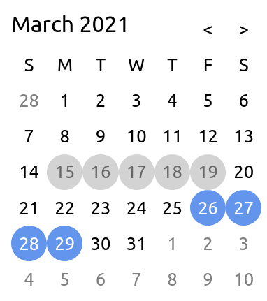

Demo of a calendar component implemented in Angular and React

## Screenshot

Core Files:
- [angular view](./booking-ng/src/app/app.component.html)
- [angular controller](./booking-ng/src/app/app.component.ts)
- [react view + controller](./booking-react/src/App.tsx)

## Comparison

| | Angular | React |
|---|---|---|
| Effective line of code* | 62 | 80 |
| Build Time* (seconds) | 20 | 13 |
| Built Size | 280 KiB | 224 KiB |
| node_modules size | 396 MiB | 292 MiB |
| init with pnpm* | possible | impossible |

### Remarks

**Effective line of code** counts the 'template' and 'jsx' representing the VDOM, and the typescript controllers, including import statements, type signatures, and empty lines.

The sass/scss are not counted toward the loc.

The angular module file is not counted because it is auto generated and do not require manual modification.

**Build Time**: with optimized flags (with `--prod` and `--aot` for angular build)

**init with pnpm**:
React project created with `create-react-app` must install packages with `npm` or `yarn` during the creation process;
Angular project created with `ng new` supports `--no-install` flag to allow developers install the packages on their own.
